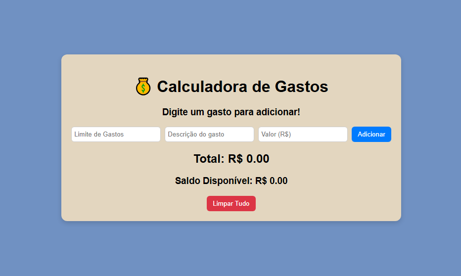

# 💰 Calculadora de Gastos

> Projeto pessoal para testar conhecimentos adquiridos no programa **Oracle Next Education (ONE)**.  
> Aplicação simples que permite definir um **limite de gastos**, adicionar despesas e visualizar o **total gasto** e o **saldo disponível**.

---

## 🖼️ Imagem

```markdown

```

---

## 📌 Funcionalidades
- Definir um **limite de gastos**.
- Adicionar despesas com **descrição** e **valor**.
- Exibir a lista de despesas.
- Calcular o **total** de gastos.
- Mostrar o **saldo disponível** (limite - total).
- Botão para **limpar tudo**.

---

## 🚀 Como usar
1. Clone ou baixe este repositório para o seu computador.
2. Garanta que os arquivos `index.html`, `style.css` e `script.js` estão na mesma pasta.
3. Abra o `index.html` no navegador (duplo clique) — isso já funciona sem servidor.
   - Alternativa: rode um servidor simples (recomendado para algumas funções):
     ```bash
     python -m http.server 8000
     # depois acesse: http://localhost:8000
     ```
4. No campo **Limite de Gastos** digite o valor máximo que deseja gastar.
5. Em **Descrição do gasto** coloque um nome (ex.: "Almoço").
6. Em **Valor (R$)** coloque o valor do gasto (ex.: 12.50) e clique em **Adicionar**.
7. Veja a lista de gastos, o **Total** e o **Saldo Disponível** atualizarem.
8. Para apagar tudo, clique em **Limpar Tudo**.

---

## 💡 Ideias futuras / roadmap
1. **Persistência**: salvar lista e limite em `localStorage`.
2. **Edição de itens**: permitir editar valor/descrição.
3. **Remover item**: botão para excluir um gasto.
4. **Categorias**: adicionar categoria (alimentação, transporte, etc.) e filtros.
5. **Exportar**: permitir exportar a lista em CSV.
6. **Gráficos**: adicionar um gráfico simples (recharts ou Chart.js) para visualizar gastos por categoria.
7. **Teste unitário**: separar lógica (funções de cálculo) para facilitar testes.
8. **Validação e acessibilidade**: labels associadas, mensagens ARIA e validação client-side.
9. **Deploy**: hospedar no GitHub Pages.

---

## 🧑‍💻 Sobre o desenvolvedor
**João** — desenvolvedor iniciante / estudante do programa *Oracle Next Education (ONE)*.  
Projeto pessoal criado para praticar JavaScript, DOM e conceitos básicos de front-end.  

- LinkedIn: `https://www.linkedin.com/in/seu-linkedin` *(substitua)*
